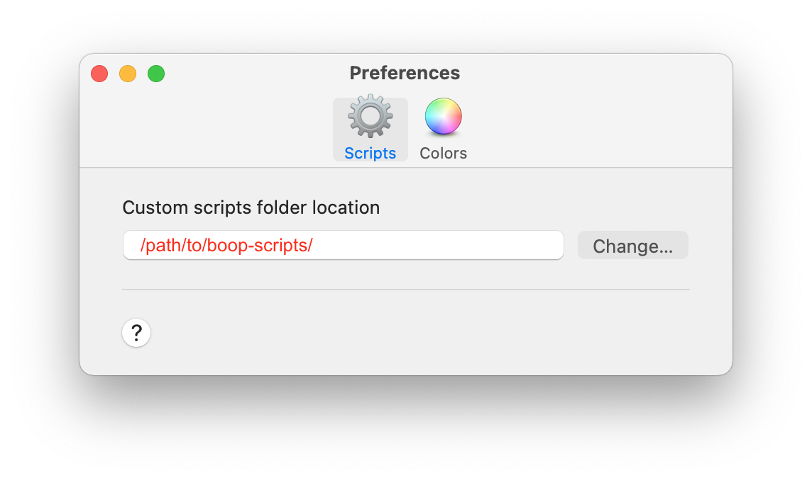

# boop-scripts

Collection of useful custom scripts for Boop (https://github.com/IvanMathy/Boop).

## Installation

Clone this repo locally, and then point Boop to the local directory:

## Available Scripts
### Text
- Slugify
